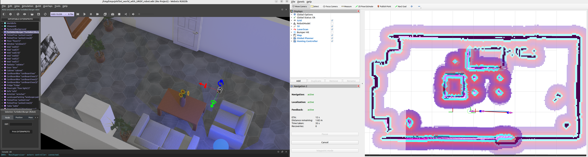
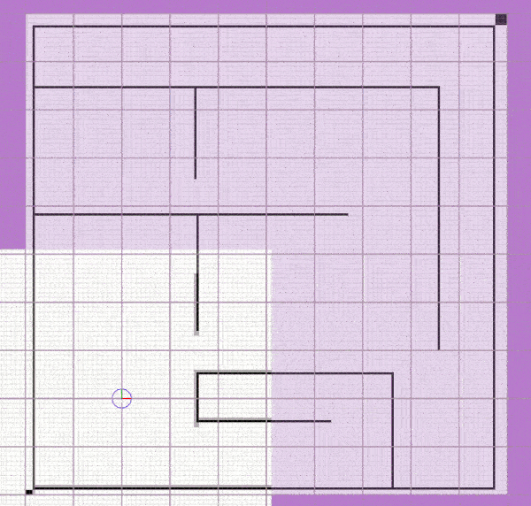
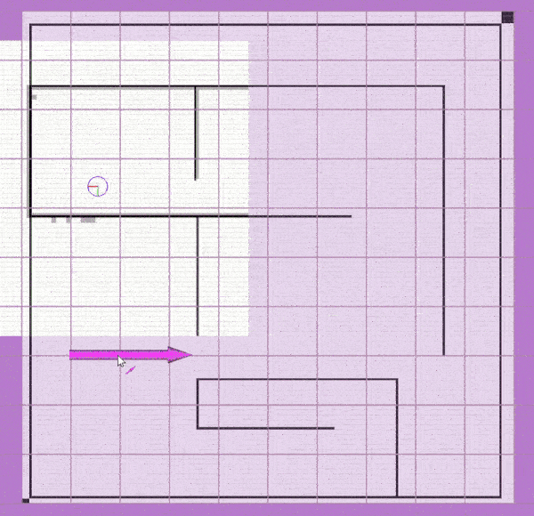

# homing_local_planner ROS Package

**A simple, easy-to-use, and effective path tracking planner with a complete demo.**

The homing_local_planner package implements a plug-in to the *nav_core::BaseLocalPlanner* of the 2D navigation stack in ROS1 or a plug-in to the *nav2_core::Controller* of the  Nav2 in ROS2. The underlying method called Homing Control has the objective to guide a robot along a reference path, which is a pure pursuit algorithm Implemented based on [1]  as reference. And code implementation of the package has some reference to [teb_local_planner](http://wiki.ros.org/teb_local_planner).

This scheme considers a dynamic goal pose on the path located some distance ahead of the robots current pose. The robot is supposed to chase the moving goal pose (look-ahead pose) on the path. This path tracking strategy is similar to human drivers that steer a vehicle towards a dynamic lookahead point on the road, which distance depends on the vehicle speed, road curvature and visibility. The obstacle avoidance feature is currently not designed to allow for detours and exploration. When an obstacle appears on its planned path, the robot slows down or stops until the obstacle is cleared, just like a rail vehicle.


##  Install 

Git clone this repository  and checkout the corresponding branch, then compile.

```shell
cd ~/your_ws/src
git clone https://github.com/zengxiaolei/homing_local_planner.git
cd ..
colcon_build / catkin_make
```


## Parameter

*Robot*:

- **max_vel_x**: maximum velocity in the x direction of the robot
- **max_vel_theta**: maximum angular velocity of the robot
- **acc_lim_x**: maximum translational acceleration of the robot
- **acc_lim_theta**: maximum angular acceleration of the robot
- **min_turn_radius**: minimum turning radius of the robot
- **turn_around_priority**: if true, the robot preferentially adjusts the orientation to fit the direction of the path
- **stop_dist**: When the Euclidean distance between the nearest lethal point on planned path and the robot frame origin is less than this distance, the robot stops
- **dec_dist**:  When the Euclidean distance between the nearest lethal point on planned path and the robot frame origin is less than this distance, the robot slows down          

*Trajectory*:

- **max_global_plan_lookahead_dist**: specify maximum length (cumulative Euclidean distances) of the subset of the global plan taken into account for optimization
- **global_plan_viapoint_sep**: min. separation between each two consecutive via-points extracted from the global plan
- **global_plan_goal_sep**: min. separation between the last via-point and goal pose
- **global_plan_prune_distance**: distance between robot and via_points of global plan which is used for pruning

*Goal Tolerance*:

- **yaw_goal_tolerance**:  allowed final orientation(yaw) error
- **xy_goal_tolerance**: allowed final euclidean distance to the goal position

*Optimization*:

- **k_rho**: proportional parameter for linear velocity adjustment based on the Euclidean distance of the robot position to the current target
- **k_alpha**: proportional parameter for angular velocity adjustment based on the tangential angle of the target position in the robot's frame of reference
- **k_phi**: proportional parameter for angular velocity adjustment based on the difference between the robot's orientation(yaw) and the current target orientation(yaw)


## Run and Demo

### 3D Webots Simulator for ROS2 Humble

Firstly make sure the simulation platform is installed.

[webots installtion (ubuntu) in detail](https://docs.ros.org/en/humble/Tutorials/Advanced/Simulators/Webots/Installation-Ubuntu.html)

#### Run

Then you can launch it easily by following command:

```shell
ros2 launch homing_local_planner robot_launch.py 
```

#### Demo

The launchecd world is as follows:




### 2D Stage Simulator for ROS1 and ROS2 foxy

There's a complete demo based on 2D stage simulator in this package. Firstly make sure the simulation platform is installed.

- ROS2: [stage_ros2](https://github.com/n0nzzz/stage_ros2)

- ROS1:  [stage_ros](https://github.com/ros-simulation/stage_ros)

#### Run

Then you can launch it easily by following command:

- For ROS2:


```shell
ros2 run stage_ros stageros /home/.../homing_local_planner/test/stage/maze_diff_drive.world
ros2 launch homing_local_planner demo.launch.py
```


- For ROS1:

```
roslaunch homing_local_planner demo.launch
```

#### Demo

Dyamic gif demo is as following.

If there's a problem with display, you can check file path: /.README_img/homing_demo.gif

- Parking:


- Forward navigation:



- Navigation with direction adjustment and backwards:




## References

[1] Astolfi, A., Exponential Stabilization of a Wheeled Mobile Robot Via Discontinuous
Control, Journal of Dynamic Systems, Measurement, and Control, vol. 121, 1999

[2] C. Rösmann, F. Hoffmann and T. Bertram: Integrated online trajectory planning and optimization in distinctive topologies, Robotics and Autonomous Systems, Vol. 88, 2017, pp. 142–153.

[3] Mobile Robot Course of The Institute of Control Theory and Systems Engineering at TU Dortmund


## License

The *homing_local_planner* package is licensed under the **BSD 3-Clause** license. It depends on other ROS packages, which are listed in the package.xml. They are also BSD licensed.

Some third-party dependencies are included that are licensed under different terms:

- *Eigen*, MPL2 license, [http://eigen.tuxfamily.org](http://eigen.tuxfamily.org/)
- *Boost*, Boost Software License, [http://www.boost.org](http://www.boost.org/)

All packages included are distributed in the hope that they will be useful, but WITHOUT ANY WARRANTY; without even the implied warranty of MERCHANTABILITY or FITNESS FOR A PARTICULAR PURPOSE. 